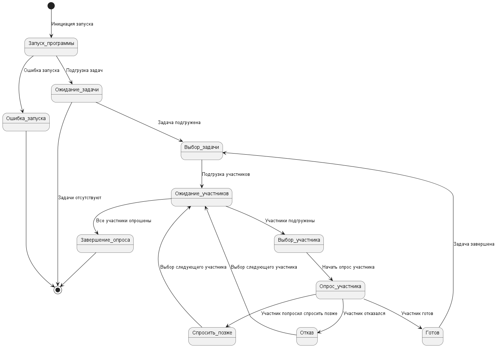

## Диаграмма состояний (State Diagram)

> **Диаграмма состояний (State Diagram)** это графическое представление различных состояний объекта или системы и переходов между этими состояниями. Диаграмма состояний помогает разработчикам понять и задокументировать поведение системы при различных условиях и взаимодействиях.

### Описание диаграммы состояний:
1. **Запуск программы:** Начальное состояние, программа начинает свою работу.
2. **Ошибка запуска:** Переход к этому состоянию происходит при ошибке запуска.
3. **Ожидание задачи:** Программа ждет подгрузки задач для обработки.
4. **Выбор задачи:** Программа выбирает задачу для обработки.
5. **Ожидание участников:** Программа ждет подключения участников для опроса.
6. **Выбор участника:** Программа выбирает участника для опроса.
7. **Опрос участника:** Программа начинает опрос конкретного участника.
    - **Готов:** Участник готов взять задачу, переход к выбору задачи.
    - **Отказ:** Участник отказался, программа продолжает опрос следующего участника.
    - **Спросить позже:** Участник попросил спросить позже, программа возвращается в состояние ожидания участников.
8. **Завершение опроса:** Все участники опрошены, программа завершает опрос.
9. **Задачи отсутствуют:** Переход к этому состоянию происходит, если задачи отсутствуют.

### Диаграмма состояний (State Diagram)

[исходник диаграммы](StatesDiagram.plantuml)
