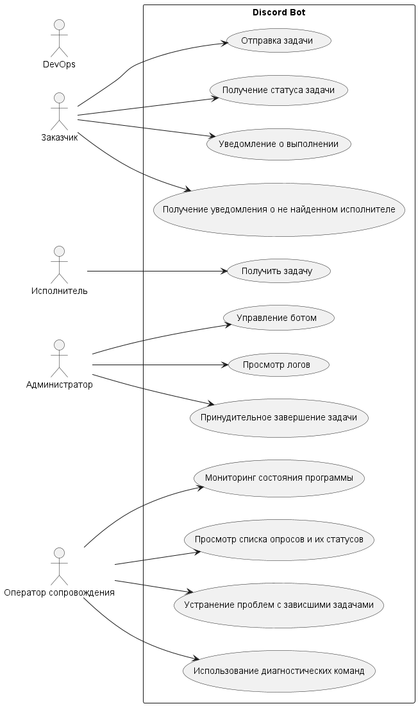

## Use Case (Диаграмма прецедентов)
> **Use Case (Прецедент использования)** — это описание взаимодействия пользователя (актора) с системой
для достижения определенной цели. Диаграмма прецедентов использования иллюстрирует различные способы,
с помощью которых пользователи могут использовать систему, отображая их роли и связанные с ними
функциональные требования. Прецеденты помогают разработчикам понять и задокументировать требования
к системе, облегчая процесс анализа и проектирования.

### Акторы:

- **Заказчик**: Отправляет задачи боту, запрашивает статус задачи, получает уведомления о выполнении задачи или о том, что исполнитель не найден.
- **Исполнитель**: Получает задачи от бота и выполняет их.
- **Администратор**: Управляет ботом, имеет доступ к логам и может принудительно завершать задачи.
- **Оператор сопровождения**: Следит за работой системы, просматривает логи, устраняет проблемы с зависшими задачами.
- **DevOps**: Ответственный за развертывание и запуск программы.

### Прецеденты:

- **Отправка задачи**: Заказчик отправляет боту задачу через команду в Discord.
- **Получение статуса задачи**: Заказчик запрашивает статус задачи.
- **Уведомление о выполнении**: Бот уведомляет заказчика о том, что задача выполнена.
- **Получение уведомления о не найденном исполнителе**: Бот уведомляет заказчика о том, что исполнитель не найден.
- **Получение задачи**: Исполнитель получает задачу от бота.
- **Управление ботом**: Администратор управляет ботом и его настройками.
- **Просмотр логов**: Администратор или оператор сопровождения просматривает логи для анализа.
- **Принудительное завершение задачи**: Администратор или заказчик может принудительно завершить задачу.
- **Мониторинг состояния программы**: Оператор сопровождения следит за состоянием программы.
- **Устранение проблем с зависшими задачами**: Оператор сопровождения устраняет проблемы с зависшими задачами.
- **Использование диагностических команд**: Оператор сопровождения использует диагностические команды для получения сведений о работе системы.
- **Настройка и развертывание системы**: DevOps отвечает за настройку и развертывание системы.

### Диаграмма вариантов использования

[исходник диаграммы](UseCase.plantuml)
